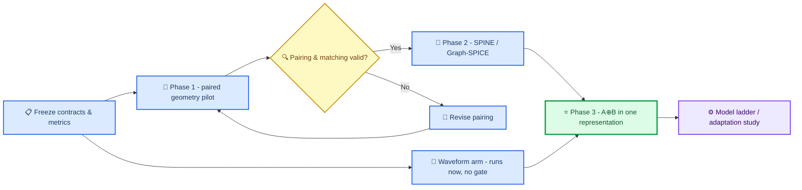

<!-- MIGRATION NOTE — added 23 August 2026 -->
> 🔒 **Private working record — not for the shared collaboration view.**
> Migrated from the stale `paper3/` folder (dated 12 August 2026). It contains
> meeting strategy, an assessment of a collaborator's review, and negotiating
> positions. Decide deliberately before pushing the branch that carries it to a
> remote Junjie can read; the audit's recommendation was to keep this private and
> extract only (a) the review log and (b) the T0–T5 checklist.
>
> ⚠️ **Also stale in three specific ways**, all resolved in
> [`PAPER3_AUDIT.md`](PAPER3_AUDIT.md):
>
> - Checklist items **T0.6, T1.3 and T1.4 are marked done and are not** (audit C3, C4, §5).
> - The whole B-first sequence assumes NuBench event pairing, which does not exist (P2.1).
> - "The result closest to hand" (MSE vs χ² scored by the TIDMAD benchmark) rests on a
>   consequence metric the TIDMAD authors disclaim (P2.2), and on `infer.py` bugs C1/C2
>   that would have made any score produced before 17 August meaningless.
>
> What is still uniquely here and worth reading: the 12 annotated comments from
> Junjie with the response to each, and the `transformer/tidmad` structural
> assessment.

# Paper 3 Personal Research Guide

_Private explanatory record synthesizing the proposal, Junjie's annotated PDF,
his 11 August email, and inspection of the `transformer/` model package. Revised
12 August 2026. This file preserves interpretation and decision rationale; it is
not intended for the common repository._

> 📌 **Document boundary:** Use this guide to understand the reasoning,
> feedback interpretation and decision history. Use
> [`REVISION_PLAN.md`](REVISION_PLAN.md) as the neutral, canonical execution plan
> for the common repository.

---

## 📋 Decision summary

- Junjie's feedback is enthusiastic and directional, not approval of the current
  claims. Two of his comments independently reproduce concerns already in the
  note — treat those as validation, not as work items.
- Junjie's scientific suggestion is **B (paired detector-geometry robustness)
  before A (SPINE/Graph-SPICE representation diagnosis)** because B begins from
  a physics-supported modification. The later implementation decision does not
  introduce either complex system first: it tests the underlying questions on
  TIDMAD, then NuBench, with Panda optional.
- **A⊕B unification is the scientific payoff and is now a named Phase 3**, not
  an afterthought. Junjie's closing PDF note — distinguish a physics-supported
  detector modification from a representation perturbation with no science
  meaning, inside one representation — is the sharpest idea in his review and v1
  dropped it.
- **Mechanism metrics are promoted to co-primary** alongside attribution F1.
  Junjie is right that an F1-only endpoint does not justify hooking internals.
- **Run the waveform arm in parallel, not behind the geometry gate.** It is
  fully synthetic, unblocked today, and is where C4 is decided.
- The frozen diagnostic core stays frozen. After its endpoints, thresholds and
  layer-localization decision are fixed, diagnosis-guided LoRA becomes the
  causal validation; untargeted LoRA and full supervised fine-tuning (SFT) are
  comparators. Reinforcement learning stays out entirely.
- Set up a new shared repository, a meeting cadence, and a runnable path Junjie
  can execute while he reads in.

---

## 🎯 Paper contribution hierarchy

The paper is organized around one primary contribution and three deliberately
ordered validation levels:

| Level | Paper role | Required result |
| --- | --- | --- |
| Core contribution | Frozen representation diagnosis | Attribute and localize consequential representation failures without changing the diagnosed model |
| Causal validation | Diagnosis-guided LoRA mitigation | Adapting only the implicated stage recovers consequence better than adapting a deliberately non-implicated stage |
| Comparators | Full SFT and untargeted LoRA | Establish whether localization adds value beyond generic adaptation |
| Optional foundation-model validation | Localized LoRA on Panda | Test transfer only after the simpler TIDMAD/NuBench design works |

This hierarchy upgrades the paper's trajectory from *finding where a frozen
representation fails* to testing whether the diagnosis predicts *where an
adaptation will successfully repair it*. General fine-tuning that merely raises
the score is not a contribution: the layer choice must be made by the frozen
diagnostic and evaluated against controls on untouched data.

LoRA and SFT are not opposites. LoRA is a parameter-efficient form of
fine-tuning and may itself use supervised labels. For the small TIDMAD
transformer, full SFT is computationally easy, so LoRA is justified as a
localized, low-rank intervention rather than as a compute-saving device. For
Panda's 91M-parameter backbone, parameter efficiency becomes an additional
practical advantage.

The required experimental order is:

1. Freeze the base model, representation endpoints, alarm thresholds and
   localization rule.
2. Diagnose the failure and select the implicated stage without using the final
   evaluation set.
3. Train diagnosis-guided LoRA, wrong-stage LoRA, untargeted LoRA and full-SFT
   arms on the same adaptation split and supervision budget.
4. Evaluate clean performance, diagnosed-shift recovery, held-out severities
   and an unknown perturbation family on untouched data.

---

## 💬 What Junjie is saying

### Position

1. He finds the project interesting and wants to start work now, not to
   renegotiate the framing.
2. His PDF comments are offered as alternative angles, in his words.
3. He wants working infrastructure: a repository he can actually open, regular
   meetings, and a division of labour. He plans to read background material but
   wants to read the current code in parallel.

### Every substantive comment, and the response

| # | Where | Junjie's point | Response |
| --- | --- | --- | --- |
| 1 | Abstract, "responds badly" | The cause could be a rare subgroup hidden by averaging, or a redundant latent direction the output head ignores. The next sentence already resolves it | Name both mechanisms explicitly; drop the normative wording |
| 2 | Abstract, attribution + consequence | "Central piece of this work" | Confirmation. Move both to the first two sentences of the abstract and the contribution |
| 3 | Two discordant regimes | There are four regimes, not two. And the real target may be: **given a strong alarm, can we tell which outcome follows?** | Add the 2×2 matrix, and adopt his conditional framing as the C4 primary endpoint (see below) |
| 4 | "uncertainty" | Generated noise covariance, or model uncertainty? | Three distinct quantities, three distinct names |
| 5 | "PSD" | Undefined | Expand on first use: power spectral density |
| 6 | "The measurement is corrupted" | Corruption is domain-specific; is there an umbrella term? Sticky note: "we can of course limit to what we care for this work" | Umbrella term **acquisition-contract violation**, plus an explicitly closed enumeration. **Take the permission he offered** — narrow N to a fixed list rather than claiming generality |
| 7 | N vs S | Does "supported physics" include the forward pipeline? If a discrepancy is absent from the forward model, how can it be called a bug rather than new physics? Correlated error and known violations are the strongest signals but only exclude known effects | He has independently rederived the note's identifiability limit. Keep §1's limit verbatim, cite his framing, and restrict all attribution to declared interventions. Unknown → abstain and escalate |
| 8 | C2 endpoints | The metrics look "binary-classification style". What about representation-space vector distance, or higher-order gradients to find the breaking junctions of the model? | **Promote to co-primary.** See "Metric restructure" |
| 9 | C4 | AUC is a good tool here, e.g. magnitude vs confidence | Keep AUROC/AUPRC; separate uncalibrated alarm magnitude from a calibrated consequence risk. Never call a raw score "confidence" |
| 10 | Douglas et al. | Recalls it may have been rejected twice; unsure, will check arXiv | **Checked.** arXiv:2411.09864 is currently at v3 (4 February 2025). That is not evidence for or against rejection. Cite the current arXiv preprint; do not repeat the rejection claim; the complementarity argument is unaffected |
| 11 | Extensions A/B | B first, then A, then **try to combine A&B in one representation and distinguish the detector-geometric modification from the representation perturbation** — the former is real physics-supported, the latter is an artifact with no science meaning | Adopted as the three-phase spine of the collaboration |

---

## 🤔 What Junjie is asking

His comments and email contain three different kinds of requests. Keeping them
separate avoids treating a scientific question as an agreed experiment or
mistaking a collaboration request for a claim about the paper.

### Scientific questions

1. Could an apparently abnormal response come from a rare subgroup hidden by
   averaging, or from a latent direction that the output head does not use?
2. Should the alarm–consequence analysis cover all four cells, especially the
   distinction between consequential and harmless outcomes after a strong
   alarm?
3. Does “uncertainty” mean generated noise covariance or model uncertainty?
4. Is there a domain-independent term for measurement corruption, and should
   the study restrict itself to a closed set of relevant failures?
5. What counts as supported physics when the forward model may be incomplete?
6. Can representation-space vector distances or higher-order gradients locate
   the stage at which the model begins to fail?
7. Can AUC-like metrics connect alarm magnitude with downstream consequence?

### Experimental-direction questions

1. Should the representation being diagnosed come from the existing simple
   model or from Sam Young’s Panda foundation model?
2. Would it be more logical to begin with the simple representation and use
   Panda only after the diagnosis protocol works?
3. Should the physics-supported geometry study run first, followed by the
   SPINE/Graph-SPICE study?
4. Can both directions later be combined inside one representation so the
   method must distinguish a physical detector modification from a
   non-physical representation artifact?

### Collaboration requests

1. Create a new repository that both collaborators can access.
2. Establish a regular meeting schedule.
3. Agree on the division of work.
4. Provide a runnable version of the current code so he can learn the project
   while reviewing the background material.

### What he is not asking

He does not explicitly request LoRA, full SFT or reinforcement learning. LoRA
and SFT are later additions to the research design: LoRA first supplies a
controlled representation intervention, and diagnosis-guided LoRA later tests
whether localization predicts repair. Reinforcement learning remains outside
the proposed scope.

---

## 🔬 The idea v1 missed: A⊕B as a labelled N-vs-S surrogate

Junjie's closing note is worth more than the sequencing advice it came wrapped in.

The hard part of the proposal is that N and S both move the observed input
distribution, so no input-space test separates them, and no real dataset gives
ground-truth labels for the distinction. Junjie's construction supplies a clean
laboratory version of exactly that contrast:

| Class | Instantiation | Physics content | Ground truth |
| --- | --- | --- | --- |
| Physics-supported modification | Detector geometry change under a matched acquisition intervention | Real — the measurement apparatus genuinely differs | Known by construction |
| Non-physical representation artifact | A perturbation applied to the representation itself with no forward-model correlate | None | Known by construction |

If a diagnostic cannot separate these two — where the answer is known and the
contrast is maximal — it will not separate N from S on real data. If it can, the
mechanism by which it does so is directly inspectable, because both sides are
generated rather than observed. This gives the study a positive control with a
label, which the current design lacks.

This also settles the LoRA question (see below): a small adaptation applied to a
frozen encoder is a clean, cheap, reproducible generator of the second class.

---

## 📊 Metric restructure (responding to comment 8)

v1 kept macro-F1 primary and demoted representation geometry to "named
secondary" and gradients to "exploratory". That is backwards for a study whose
entire novelty is layerwise representation evidence. Restructure into two
co-primary families reported side by side:

**Operational family — can a practitioner act on it?**
Macro-F1 over {N, S}, multi-label F1 for mixtures, selective risk and
risk–coverage AUC under conformal abstention, detection power at a 1%
false-alert budget, delay in windows. Unchanged from the current note.

**Mechanism family — what is the representation actually doing?**
Standardized representation displacement normalized by clean within-class
dispersion; k-NN neighbour retention; subspace principal angles between clean
and perturbed representations; layerwise sensitivity profile, i.e. the depth at
which a consequential change first becomes visible; per-family response
direction in representation space.

Report both. The paired ΔF1 confidence interval stays as the honest-negative
mechanism, and gains an equivalent mechanism-family counterpart so that a null
result is interpretable on both axes.

**Higher-order gradients** — Junjie's "breaking junctions" — stay exploratory,
but with a stated promotion criterion rather than an open-ended caveat: they
become a reported endpoint if they are stable across seeds and add measurable
information beyond the mechanism family above. Otherwise they are dropped and
that is recorded.

---

## 🎯 Revised C4: the conditional framing

Junjie's question — "the main target is to distinguish the strong alarm for
different outcomes?" — is a better primary endpoint than a correlation over all
cells.

| Alarm | Consequence | Interpretation | Handling |
| --- | --- | --- | --- |
| Low | Low | Stable or harmless | No action |
| High | Low | Detectable but harmless | Suppress or contextualize — **false-alarm cost** |
| Low | High | Consequential blind spot | **Most serious monitoring failure** |
| High | High | Useful consequential alert | Rank severity, act |

**Primary C4 endpoint (revised):** conditional on a strong alarm, AUROC for
K ≥ κₘ. That is, given that the monitor has fired, does alarm magnitude separate
consequential from harmless cases? Report the low-alarm/high-consequence rate at
the operating point alongside it, since that cell is the one that damages
science silently.

**Secondary:** within-family Spearman ρ(A,K) over all cells, amplitude bias,
calibration error, subspace angle, neighbour retention.

Calibration language: alarm magnitude is an uncalibrated score. "Consequence
risk" is a calibrated probability that scientific loss exceeds κₘ. Reliability
curves, Brier score and ECE apply only to the latter.

---

## 🗺️ Research sequence

### Phase 0 — collaboration setup (this week)

- New repository both collaborators can access. The old link was not visible to
  Junjie; do not debug it, just recreate.
- A one-command smoke path on a small shareable sample, so Junjie can run
  something on day one while he reads in.
- Record environment, data provenance, checkpoint provenance, expected outputs.
- Scoping meeting, then a fixed weekly or fortnightly cadence.
- Provisional ownership: Dowling owns the diagnostic harness, waveform
  generator, and the note. Junjie owns physical validity of the geometry
  contrast, the downstream physics metrics, and the SPINE-side scoping. Claims,
  thresholds and interpretation are frozen jointly.

### Parallel track — waveform arm (start immediately, no gate)

The waveform testbed is fully synthetic, needs no NuBench parity, and is where
C4 is actually decided, because the generator supplies both the assumed Σ̂ and
the realized Σ. v1 placed everything behind the geometry gate; there is no
reason for this arm to wait, and it gives the collaboration a result while the
harder joint infrastructure is being built.

### Phase 1 — B, paired detector-geometry pilot

Common latent events, two geometries, one declared acquisition intervention.
Minimum deliverables: one paired contrast; one frozen representation extractor;
one mechanism endpoint; one downstream physics endpoint; clean plus
positive-control plus intervention cells at frozen severities; intervals that
resample event groups and simulation seeds separately.

Passes only if pairing, matching variables, preprocessing, extraction and
downstream metrics are reproducible and the positive control behaves. A geometry
response without a passed pairing gate is a consistency comparison, not a causal
claim.

### Phase 2 — A, SPINE/Graph-SPICE transfer

One frozen checkpoint, one physically justified perturbation, clean plus three
frozen severities, one point-representation metric, one downstream clustering
metric, near-vertex stratification declared before evaluation.

### Phase 3 — A⊕B unification ⭐

Within a single representation, test whether the diagnostic separates a
physics-supported detector modification from a non-physical representation
perturbation, using the labelled construction in the section above. This is the
scientific headline and should be written into the note as the target of the
collaboration, not as an optional extension.

### Smaller-first implementation decision — 12 August 2026

The scientific content of A and B will be tested before introducing Panda or
requiring SPINE/Graph-SPICE infrastructure:

1. **TIDMAD first:** establish frozen representation diagnosis on the compact
   waveform transformer, then compare an instrument-grounded noise/covariance
   change with a matched non-physical representation perturbation.
2. **NuBench second:** replicate the diagnosis on native DynEdge and attempt the
   detector-geometry version of B when common latent events or a defensible
   matched design are available.
3. **A⊕B on the smaller systems:** test physical-versus-artifact provenance at
   matched representation displacement, then perform diagnosis-guided LoRA with
   wrong-stage, untargeted-LoRA and full-SFT controls.
4. **Panda only if feasible:** use the native PILArNet-M task as optional
   scale-transfer validation after the smaller-model conclusion is established.

This does not claim that TIDMAD or NuBench reproduces the exact SPINE/Graph-SPICE
point-clustering and near-vertex setting. They test the underlying A question—
whether frozen internal representations support diagnosis and localization.
TIDMAD tests a physical measurement analogue for B; only a paired NuBench
geometry experiment supports the original detector-geometry-specific B claim.
Direct SPINE/Graph-SPICE remains a future domain-specific extension rather than
an entry requirement.

---

## 🤖 Foundation-model and adaptation implications

The foundation-model question is narrow: **should the object of representation
diagnosis be the existing model or Sam Young's Panda model?** His tentative
preference is to start from a simple representation because Panda is harder.

Three consequences:

1. **He is not proposing a foundation-model study.** The foundation model is a
   candidate *subject* of diagnosis, not a research target. "B" is the geometry
   pilot and implies nothing about architecture.
2. **He is not proposing any training.** Nothing in his message asks for LoRA,
   fine-tuning, or RL. Reading it as an invitation to train would change the
   research question from *can failure be diagnosed* to *can it be fixed*, which
   is a different paper.
3. **Agree with his instinct.** Start with the simplest reproducible frozen
   representation. A foundation model enters only when hooks, task, inputs and
   outputs are demonstrably comparable to the simple baseline.

### Model ladder

| Level | Model | Purpose | Entry gate |
| --- | --- | --- | --- |
| M0 | Simplest existing frozen model | Debug design and metrics | Runnable now |
| M1 | Dowling's frozen model | Owned baseline | M0 reproducible |
| M2 | Diagnosis-guided adaptation on TIDMAD/NuBench | Causal validation with wrong-stage LoRA, untargeted LoRA and full-SFT controls | Frozen endpoints and localization decision fixed |
| M3 | Panda frozen diagnosis plus localized-LoRA replication | Optional transfer to a larger pretrained representation | TIDMAD/NuBench adaptation result complete; Panda task, inputs, hooks and outputs comparable |

Identify at the first meeting exactly which model "Sam's foundation model"
refers to — pretraining task, accessible layers, input modality, licence,
compute, and whether its downstream task can be matched fairly.

### LoRA first as a control, then as diagnosis-guided mitigation

v1 filed LoRA under "later mitigation experiment". There is a better role, and
it comes straight out of Junjie's A⊕B note:

**Use a small adaptation as a controlled generator of non-physical
representation perturbations.** Applying LoRA to a frozen encoder produces a
representation change with a known magnitude, a reproducible seed, and zero
physics content — precisely the "artifact with no science meaning" class Phase 3
needs. It is cheap, it is labelled by construction, and it never touches the
frozen diagnostic baseline, because the diagnostic is still evaluated on the
frozen model; the adaptation only manufactures the perturbation.

Mitigation enters only after the frozen diagnosis is complete. The implicated
stage is selected once, then localized LoRA at that stage is compared with LoRA
at a deliberately non-implicated stage, untargeted LoRA over all eligible
stages, and full SFT. This makes repair a causal validation of localization
rather than retrospective evidence for the original diagnostic.

**Reinforcement learning: no.** There is no reward signal, no sequential
decision problem, and nothing in Junjie's message points at it. Adding it would
weaken the note. If a decision-theoretic framing is ever wanted, the honest
version is a cost-sensitive threshold on the existing alarm–consequence
matrix — not RL.

---

## 🧱 Model assessment — `transformer/tidmad`

**Scope provenance.** TIDMAD originated in the NeurIPS-mini/transfer-paper and
Paper 1 work as a public real-data noise-geometry benchmark. The original Paper
3 proposal named only controlled waveforms and the local noise simulator. This
v2 plan deliberately reuses TIDMAD for a different claim: representation
diagnosis and the C4 alarm--consequence test in the parallel waveform arm. The
earlier result and this diagnostic experiment must remain separately attributed.

Inspected the package on 11 August 2026. Verdict: **structurally well suited to
this study, and closer to a first result than the geometry pilot is** — but it
does not currently run end to end, and one naming claim has to be corrected.

### What it is, accurately

DELight `reconstruction_model` is the original: a compact two-stage transformer
(temporal patches → channel/band attention), AdamW + Muon, ~6.8M parameters in
the `pairwise_channel_masking` variant. `tidmad/` subclasses that backbone,
deletes the spatial/energy heads, swaps the patch-scaled absolute embedding for
a band embedding, and adds a per-patch reconstruction head, for the public
TIDMAD denoising benchmark.

**Size check: the frozen TIDMAD config is ~0.6M parameters** (d_model 128, d_ff
512, 2 heads, one temporal and one band layer; 656 stacked bands × 128 dominates
the count via the band embedding). Do not call this a foundation model in the
note. It is a compact domain transformer, and the README's masked-waveform /
contrastive pretraining section is a *roadmap*, not a completed pretraining. A
referee will check. Describe it as "a compact domain transformer with a
foundation-model pretraining roadmap" — which is both true and sufficient, since
paper 3 diagnoses representations rather than requiring scale.

### Structural strengths — why this is a good diagnostic subject

| Feature | Why it matters here |
| --- | --- |
| `_temporal_stage` and `_band_stage` already factored as separate methods | A layerwise hook surface exists without touching the model. Two clean, physically interpretable stage boundaries: *within-waveform time structure* vs *across-band structure* |
| `config.FROZEN` dataclass, docstring records every value as predeclared | The preregistration discipline paper 3 claims is already implemented in code, not just asserted in prose |
| `assert_configs_differ_only_in_loss` | Machine-checked single-difference gate. Rare and genuinely strong hygiene — it is what makes the two-arm claim defensible |
| `score.py` shells out to *unmodified upstream* `benchmark.py`, no reimplementation | The downstream consequence metric K is externally defined and cannot be accidentally tuned. Directly serves C4 |
| `loss.py` unstandardises before computing the residual | Handles a subtle trap: the input normaliser is approximately a whitener, so a loss computed in standardised space would make MSE and χ² the *same* objective and the contrast would be empty. Documented and handled |
| `psd.whitening_identity_error` | A scale-free positive control on J(f). This is an E-gate already built |
| J(f) from noise-only science files, never evaluation data | No leakage into the consequence metric |
| Hann/50%-hop COLA STFT, exact `istft(stft(x))` in the interior | The representation↔measurement map is invertible, so a perturbation injected in representation space maps back to measurement space cleanly. This is what makes the Phase-3 artifact class constructible |

### Defects — ordered by severity

Status, 12 August 2026: defects 1--4 and 6--8 below are resolved in the
working tree and covered by local tests. Defect 5 is partly resolved by moving
STFT work into DataLoader workers, but the required throughput measurement on
real files remains open. The public-data smoke is still required before any
scientific result.

1. **Original audit: `noise_geometry` was absent, so nothing imported.** `tidmad/__init__.py`
   expects a sibling `../src` from a parent repo `noise-weighted-subspace-
   reconstruction`; here the parent is `paper3/` and `transformer/src/` has no
   `noise_geometry`. `train.py`, `infer.py`, `score.py` and `psd.py` all fail at
   import today. `DEPENDENCIES.md` already records the decision to vendor four
   modules — execute it.
2. **Original audit: `train.py` never saved a checkpoint.** `save_checkpoint` is imported and
   never called; `checkpoint_period` is unused. `infer.py` requires a checkpoint
   that training does not produce. The pipeline is broken end to end.
3. **Original audit: config declared a batch size and budget the loop ignored.**
   `device_batch_size=4` and `num_workers=4` are never read; the loop takes one
   optimiser step per window with no DataLoader. `num_steps=150_000` cannot be
   reached because `_train_windows` iterates the file list exactly once with no
   epoch loop, so a run silently terminates early at an undeclared step count.
   The arms remain *comparable* because both are wrong identically, but a frozen
   config that does not match execution cannot be called predeclared.
4. **Original audit: `chi2_of` was configured but not implemented.** `train_step` maps
   `chi2_of → chi2`, so `t_chi2_of.yaml` silently runs the χ² arm. Implement it
   or delete the config; a silent alias is worse than a missing feature.
5. **Throughput.** The STFT is a Python loop of 96 `rfft` calls per window,
   executed synchronously inside the training loop alongside the h5 read. This
   will dominate wall-clock and there is no worker pool despite the config.
6. **Original audit: duplicated de-standardisation.** `infer.py` recomputes `mean_in/std_in`
   inline instead of calling `loss.per_row_stats` / `loss.unstandardise`. Train
   and inference coordinates can drift apart silently.
7. **Original audit: discoverability.** The top-level README documents only DELight and never
   mentions `tidmad/`. Junjie will not find the relevant package.
8. **Original audit: unverified append.** `_copy_reference_channel` writes a second dataset
   through the same `DenoisedFileSpec`, relying on the writer's append mode.
   Assert the resulting file's two-channel layout before trusting a score.

### The result that is closest to hand

The MSE-vs-χ² contrast **is already a C4 experiment**, and nothing about it
depends on NuBench parity, the geometry pairing gate, or Junjie's availability:

- `t_mse` is a model trained under the wrong residual weighting (implicitly
  Σ = I); `t_chi2` is the same model under Σ⁻¹.
- The scientific consequence K is the upstream benchmark score — externally
  defined, unmodifiable.
- The alarm A is representation displacement between the two arms at the
  temporal and band stages, plus the generic baselines.
- Both Σ̂ and the realized noise are known, which is exactly the property §4 of
  the note claims makes the waveform testbed decisive for C4.

This is the first result the collaboration should have. Prioritise accordingly.

### LoRA on this model — feasible, and there are two good roles

At 0.6M parameters, LoRA r=4 across the fourteen matrices is ~24k parameters,
about 3.9% of the backbone (r=2 → 1.9%, r=8 → 7.7%). Technically trivial. But at
this scale LoRA's usual justification — avoiding full fine-tuning cost —
evaporates, so it must be justified scientifically instead. It can be:

- **Role 1, artifact generator (Phase 3, recommended).** A LoRA update applied
  to the frozen encoder is a representation perturbation with known rank, a
  scalar magnitude knob (α/r), a reproducible seed, and zero physics content.
  It is the labelled "no science meaning" class the A⊕B contrast needs, and the
  invertible STFT means it can be pushed back to measurement space and scored by
  the same upstream benchmark. Cheap, honest, and it never unfreezes the
  diagnostic baseline.
- **Role 2, localized mitigation (later, and genuinely strong).** The model has
  exactly two stages. If diagnosis localizes a consequential change to one of
  them, apply LoRA *only there* and test whether consequence recovers — and
  whether applying it at the other stage does not. That converts the diagnosis
  from a description into a causal claim the study has earned. This is the
  paper-worthy version of "add LoRA after diagnosis."
- **Role 3, adaptation comparators.** Train untargeted LoRA and full SFT using
  the same adaptation split, labels, update budget where comparable, and model
  selection rule. They test whether diagnosis-guided localization adds value
  beyond generic adaptation; they are baselines, not separate contributions.
- **Role 4, general improvement — avoid.** Fine-tuning merely to make the model
  better, without a diagnosis-selected target and matched controls, is a
  different paper and contaminates the frozen baseline.

Sequencing rule: **no LoRA until the frozen diagnostic endpoints and thresholds
are fixed, the layer decision is recorded, and the MSE-vs-χ² result exists.**
The final evaluation set cannot influence localization, adaptation, or model
selection. Otherwise Role 2's causal claim has nothing to stand on.

---

## ☑️ TODO

Ordered by dependency. T0 and T1 are prerequisites for every scientific claim.
Implementation status on 12 August 2026: all local code-only parts through
T1.4 pass 20 synthetic/local tests. T0.5, T1.5 measurement, T1.6, and T1.7
remain deliberately open because they require the public HDF5 data, a
predeclared threshold, or an intentional freeze commit.

### T0 — make it run (blocking, days)

- [x] **T0.1** Vendor the four `noise_geometry.tidmad` modules (`psd.py`,
      `loader.py`, `score.py`, `splits.py`) plus their direct imports into
      `transformer/tidmad/_vendor/`, per the decision already recorded in
      `DEPENDENCIES.md`. Record the source commit hash.
- [x] **T0.2** Drop the `sys.path` injection in `tidmad/__init__.py` once
      vendored; it currently points at a parent repo that does not exist here.
- [x] **T0.3** Call `save_checkpoint` at `checkpoint_period` in the training
      loop, writing both the model state dict and a resume checkpoint, matching
      the DELight convention.
- [x] **T0.4** Add a validation pass at `eval_period` over a held-out file list
      and log both losses on it, not just the training batch.
- [ ] **T0.5** End-to-end smoke: 20 steps → checkpoint → `infer.py` → `score.py`
      on one validation file. Nothing below is meaningful until this passes.
- [x] **T0.6** Verify the two-channel layout of the denoised file that
      `_copy_reference_channel` produces before trusting any benchmark number.

### T1 — freeze integrity (blocking, days)

- [x] **T1.1** Wire `device_batch_size` and `num_workers` into a real DataLoader,
      or delete them from `TidmadTrainConfig`. A frozen config must match
      execution.
- [x] **T1.2** Add an epoch loop, or replace `num_steps` with a declared epoch
      count. Assert at startup that the declared budget is reachable from the
      available window count; fail loudly rather than terminating early.
- [x] **T1.3** Either implement `chi2_of` or remove `t_chi2_of.yaml`. Do not ship
      a silent alias.
- [x] **T1.4** Make `infer.py` call `loss.per_row_stats` and `loss.unstandardise`
      instead of duplicating them.
- [ ] **T1.5** Move the STFT off the training thread (worker pool, or precompute
      spectrograms to a cache once). Measure windows/second before and after.
- [ ] **T1.6** Run `whitening_identity_error` on the calibration windows and
      record the value as the J(f) positive control. Declare a pass threshold
      before the arms run.
- [ ] **T1.7** Re-freeze `config.FROZEN` with a timestamped commit once T1.1–T1.3
      are done, and record the hash in the note.

### T2 — diagnostic instrumentation (1–2 weeks)

- [ ] **T2.1** Add forward hooks at the two existing stage boundaries — after
      `_temporal_stage` `(B*C, N, d)` and after `_band_stage` `(B, N, C, d)` —
      plus the pooled event representation. No model edits required.
- [ ] **T2.2** Implement the mechanism-family metrics: standardized displacement
      normalized by clean within-class dispersion, k-NN retention, subspace
      principal angles, per-stage sensitivity profile.
- [ ] **T2.3** Implement the generic baselines on the same windows and false-alert
      budget: input tests, RBF-MMD, classifier two-sample, embedding
      mean/covariance distance, output tests.
- [ ] **T2.4** Fix the window definition, the false-alert budget, and the frozen
      severities. Write them into the note before any confirmatory run.
- [ ] **T2.5** Positive control: monotone band-dropout or channel masking, with
      the expected monotone response in both the mechanism metrics and the
      upstream score.

### T3 — first scientific result: MSE vs χ² as a C4 test (2–4 weeks)

- [ ] **T3.1** Train both arms to the re-frozen budget under
      `assert_configs_differ_only_in_loss`.
- [ ] **T3.2** Score both through the unmodified upstream benchmark. This is K.
- [ ] **T3.3** Compute A at both stages and for every generic baseline.
- [ ] **T3.4** Report the revised C4 primary — conditional on a strong alarm,
      AUROC for K ≥ κₘ — plus the low-alarm/high-consequence rate.
- [ ] **T3.5** Declare κₘ for TIDMAD **before** step T3.2 is read. The upstream
      score is an SNR-style quantity; state the physically meaningful degradation
      in those units, not a generic percentage.
- [ ] **T3.6** Report the paired ΔF1 interval and its mechanism-family
      counterpart, including the equivalence outcome if the internals do not
      beat the generic arm.

### T4 — Phase 3 LoRA artifact and diagnosis-guided repair (after T3)

- [ ] **T4.1** Implement a LoRA wrapper over the fourteen backbone matrices with
      r and α exposed as the perturbation magnitude knob.
- [ ] **T4.2** Generate the non-physical class: seeded random low-rank updates at
      three frozen magnitudes, pushed back through the invertible STFT and scored
      by the same upstream benchmark.
- [ ] **T4.3** Generate the physics-supported class from declared acquisition
      interventions at matched representation-displacement magnitude — matching
      on displacement is what makes the contrast non-trivial.
- [ ] **T4.4** Test whether the diagnostic separates the two at matched
      displacement. Report per-stage, since the two stages may carry the contrast
      differently.
- [ ] **T4.5** Freeze the localization decision and construct four matched
      adaptation arms: LoRA at the diagnosed stage, LoRA at the deliberately
      non-implicated stage, untargeted LoRA over all eligible stages, and full
      SFT. Use the same adaptation split, labels and model-selection rule; match
      the update budget where scientifically meaningful and report it otherwise.
- [ ] **T4.6** Evaluate every arm on untouched data: clean performance,
      diagnosed-shift recovery, held-out severities, an unknown perturbation
      family, representation displacement, downstream consequence, calibration
      and abstention. Report catastrophic nominal regression explicitly.
- [ ] **T4.7** Claim causal validation only if diagnosed-stage LoRA recovers the
      downstream consequence better than wrong-stage LoRA and the result is
      stable across seeds. Untargeted LoRA and full SFT bound the value of
      localization; a generic score increase is not supporting evidence.
- [ ] **T4.8** Optional only after T4.7: repeat localized LoRA on Panda's frozen
      backbone using its native PILArNet-M input and task. Treat this as
      foundation-model validation, not as the first implementation target.

### T5 — collaboration (parallel, start now)

- [ ] **T5.1** New shared repository; do not debug the old link.
- [x] **T5.2** Merge the `tidmad/` package into the top-level README, or give it
      its own. It is currently undiscoverable.
- [ ] **T5.3** Ship the T0.5 smoke path as Junjie's day-one runnable entry point.
- [x] **T5.4** Decide what data stays external and document how to obtain it.
      TIDMAD is public — say so, since it lets Junjie reproduce independently.
- [ ] **T5.5** Send the reply agreeing the B → A → A⊕B sequence; flag that the
      waveform/TIDMAD arm runs in parallel and already has a near-term result.
- [ ] **T5.6** Fix the meeting cadence and the ownership split.

---

## ✍️ Proposal edits

| Section | Change | Priority |
| --- | --- | --- |
| Abstract | Drop "responds badly"; name the rare-subgroup and redundant-direction mechanisms; lead with attribution and consequence | High |
| Gap and contribution | Scope relative to the declared simulator and forward model; state that unknown physics vs misspecification is not identifiable here | High |
| §2 Failure contracts | Expand PSD on first use; adopt "acquisition-contract violation"; **close the N enumeration** rather than claiming generality | High |
| §3 Claims | Add the 2×2 matrix; restate C4 primary as the conditional-on-alarm endpoint; separate alarm score from consequence risk | High |
| §3 C2 | Restructure into co-primary operational and mechanism families; state the gradient promotion criterion | High |
| §4 Testbeds | Explain why paired geometry is the first joint pilot; keep the pairing gate; state that the waveform arm runs in parallel | High |
| §5 Extensions | Replace with the staged roadmap and make **Phase 3 A⊕B the named target** | High |
| §6 Collaboration | Replace the open A-vs-B question with the agreed sequence, repository, cadence, ownership | High |
| §3 Related work | Cite Douglas et al. as arXiv:2411.09864v3, a preprint; no status claims | Medium |
| §7 Feasibility gate | Separate the NuBench software control from the geometry gate; **decide the parity question** (below) | Medium |

### The parity decision that should not stay open

The note currently gates all confirmatory work on unresolved re-inference
parity — 0.944° median deviation from released directions. That is roughly 6% of
the 15.28°→25.12° dropout signal, and the diagnostic is a *paired* clean-vs-
perturbed comparison in which a fixed backend offset largely cancels.

Decide explicitly, rather than leaving it open: the requirement is probably
parity *stability* across cells, not exact reproduction. Test it — measure
whether the offset is constant across severities and event strata. If it is,
declare a backend tolerance, document it, and unblock. If it drifts with
severity, it is a genuine confound and the gate stays. Either way it stops being
an open-ended blocker, which is currently the single largest schedule risk.

---

## ⚠️ Validity protections (unchanged from v1, still correct)

- Unknown cases abstain and escalate; never forced into N, S or E.
- Latent distance alone never implies scientific consequence.
- No causal geometry comparison without common latent events and declared
  matching variables.
- The foundation model does not become the first implementation target merely
  because it is more sophisticated.
- No adaptation until frozen endpoints and thresholds are fixed.
- Exploratory, pilot and confirmatory results are labelled as such in every
  report.

---

## 🔁 What changed from v1, and why

| Change | Reason |
| --- | --- |
| Added Phase 3, A⊕B unification | v1 stopped at "B then A" and dropped the second half of Junjie's PDF note, which is the strongest idea in his review |
| Mechanism metrics promoted from secondary to co-primary | v1 kept F1 primary after Junjie specifically objected that the metrics look like binary classification. If internals are hooked, mechanism must be a primary endpoint |
| Waveform arm parallelized out from behind the geometry gate | v1 serialized every phase. The waveform arm is unblocked today and decides C4 |
| C4 primary restated conditionally on a strong alarm | Junjie's framing is sharper than a global correlation and targets the cell that matters |
| LoRA reframed from mitigation to perturbation generator | Gives Phase 3 a labelled non-physical class, cheaply, without unfreezing the diagnostic |
| Diagnosis-guided LoRA promoted to causal validation | Tests whether frozen localization predicts where repair succeeds; wrong-stage LoRA, untargeted LoRA and full SFT prevent a generic fine-tuning gain from masquerading as validation |
| Panda adaptation made optional and gated | Preserves a tractable TIDMAD/NuBench entry point while allowing later foundation-model validation |
| Parity turned from an open gate into a testable decision | An indefinite blocker on a paired design that may not need exact parity |
| N enumeration closed rather than generalized | Junjie explicitly offered this narrowing; v1 did not take it |
| Douglas et al. status resolved | Verified: current arXiv version is v3; cite as a preprint, with no rejection or publication-status claim |
| Added the `transformer/tidmad` assessment and the T0–T5 TODO | The model package was inspected after v1 was written; it is closer to a first result than the geometry pilot, and it does not currently run |
| "Foundation model" language corrected to "compact domain transformer" | The frozen TIDMAD config is ~0.6M parameters and the pretraining section of its README is a roadmap, not a completed pretraining |

---

## 🤝 Decisions for the first meeting

1. Confirm the sequence: B → A → A⊕B, with the waveform arm in parallel.
2. Is B a joint pilot only, or does it replace one of the two primary testbeds?
3. Which simulator can produce common latent events under two geometries?
4. Which geometry contrast and matching variables are physically defensible?
5. What is the single downstream physics metric for B?
6. Which exact model is "Sam's foundation model"?
7. Which representation layer and mechanism metric are frozen first?
8. Does the A⊕B artifact class use LoRA, additive latent noise, or both?
9. What goes in the new repository, and what stays external?
10. Meeting cadence and ownership split.

---

## ✅ Completion criteria

- [ ] All uncertainty-related terms defined unambiguously.
- [x] All four alarm–consequence regimes shown; C4 primary stated conditionally.
- [x] Mechanism and operational endpoints both primary, with the gradient
      promotion criterion written down.
- [x] Unknown physics and misspecification excluded from attribution; routed to
      abstention.
- [x] Roadmap states B → A → A⊕B, with A⊕B named as the target.
- [x] Waveform arm documented as running in parallel.
- [x] Foundation-model use framed as a gated comparison; adaptation separated
      from diagnosis; RL absent.
- [x] Paper structure names frozen diagnosis as the core, localized LoRA as
      causal validation, full SFT and untargeted LoRA as comparators, and Panda
      localized LoRA as optional gated validation.
- [x] Parity question decided and documented, not left open.
- [x] Douglas et al. cited as arXiv v3, a preprint, with no status claims.
- [ ] Shared repository live with a runnable onboarding path.
- [ ] `tidmad` runs end to end (T0 complete) and its frozen config matches
      execution (T1 complete).
- [x] The note describes the model by its actual parameter count and calls it a
      compact domain transformer, not a foundation model.

---

## 🔗 Source basis

- [`../latex/paper3_proposal.tex`](../latex/paper3_proposal.tex) — current proposal
- Annotated `paper3_proposal.pdf` from Junjie (author field `seanxia`), 12
  comments across 3 pages; not committed here
- Junjie's follow-up email, 11 August 2026
- [arXiv:2411.09864](https://arxiv.org/abs/2411.09864) — checked 12 August 2026:
  current version is v3 (4 February 2025); cited as a preprint with no
  publication-status claim
