<!-- MIGRATION NOTE — added 23 August 2026 -->
> ⚠️ **Status: migrated verbatim from the stale `paper3/` folder (dated 12 August
> 2026) and NOT yet reconciled with the adversarial audit of 17 August.** Where
> this document and [`PAPER3_AUDIT.md`](PAPER3_AUDIT.md) /
> [`OPEN_DECISIONS.md`](OPEN_DECISIONS.md) disagree, the audit wins. Known
> conflicts to resolve before this is shared as the canonical plan:
>
> | This document says | Superseded by |
> |---|---|
> | Phase 1 is a paired NuBench detector-geometry pilot | NuBench datasets are **not** event-paired (audit P2.1). D1: re-simulate pairs with Prometheus, or run an explicit distribution-level medium contrast. |
> | TIDMAD's upstream benchmark score is the external consequence variable K | Its own authors say the denoising score "lacks direct relevance to fundamental science" (audit P2.2). D2: three-tier K, with the controlled simulator as the primary C4 testbed. |
> | SPINE/Graph-SPICE is the LArTPC direction; Panda is optional | Reversed on infrastructure cost (audit P2.3, D3). Panda first. |
> | Claim ladder C1–C5 | The LaTeX still carries C1–C4. Two ladders are in circulation (audit P1.5) — pick one. |
> | Output-null perturbation is a *control* | Promote it to the **headline experiment** (audit §6.2). |
> | Layerwise = 2 TIDMAD stages, 1 NuBench hook | 3 TIDMAD anchors and 6 NuBench hook points (D4). |
> | Related work: 8 entries | Five directly competing papers uncited (audit S3, `../reference/papers/`). |
>
> The revised sequencing that replaces §"Experimental program" is audit §6.6.

# Paper 3 Shared Revision Plan

_Objective research and implementation plan for the common repository. Updated
12 August 2026._

---

## 🎯 Research objective

Paper 3 studies whether frozen internal representations can diagnose failures
in scientific machine-learning systems and whether the resulting diagnosis
predicts downstream scientific consequence.

The paper has four ordered contribution levels:

| Level | Role | Required evidence |
| --- | --- | --- |
| Core | Frozen representation diagnosis on smaller native models | Detect, attribute and localize consequential failures on TIDMAD and NuBench without changing either diagnosed model |
| Causal validation | Diagnosis-guided LoRA | Adapting the diagnosed stage improves consequence more than adapting a deliberately non-diagnosed stage |
| Comparators | Untargeted LoRA and full SFT | Determine whether localization adds value beyond generic adaptation |
| Optional scale validation | Panda replication | Test whether the smaller-model conclusion transfers to a larger pretrained representation |

The central claim is not that representation shifts exist. It is that a frozen,
layerwise diagnostic can distinguish declared failure classes, identify where a
consequential failure emerges, and predict where a targeted adaptation will
repair it.

### Smaller-first model strategy

The minimum paper does not require a foundation model. Its main claim is tested
first on two smaller, native systems with complementary data and architectures:

1. **TIDMAD:** a compact waveform transformer with two interpretable internal
   stages and a controlled instrument-noise model.
2. **NuBench:** a native DynEdge graph model with an event representation and
   realistic detector/acquisition interventions.
3. **Panda, optional:** a later scale-transfer experiment only after the frozen
   diagnosis and repair criteria pass on the smaller systems.

Evidence from TIDMAD and NuBench supports a cross-architecture,
cross-modality claim within those two evaluated systems. It does not by itself
establish foundation-model generality. Panda is the explicit gate for that
stronger scope.

### Claim ladder

Claims expand only when the corresponding evidence gate is passed:

| Evidence completed | Permitted claim |
| --- | --- |
| TIDMAD only | Frozen layerwise diagnosis and diagnosis-guided repair work in one controlled waveform transformer |
| TIDMAD plus NuBench | The diagnostic replicates across a waveform transformer and an event-graph model |
| Paired NuBench geometries | The diagnostic characterizes a physics-supported detector-geometry modification under the declared pairing design |
| A⊕B on both smaller models | Physical-versus-artifact attribution replicates across the two evaluated systems |
| Panda native validation | The conclusion transfers to the evaluated larger pretrained LArTPC representation |

Failure at a later gate does not invalidate an earlier scoped result. It limits
the breadth of the final claim.

### Target claim wording

If both smaller-model studies pass their frozen criteria, the intended claim is:

> Across a compact waveform transformer on TIDMAD and a native event-graph model
> on NuBench, frozen layerwise representation diagnostics attribute and localize
> declared consequential failures, and the diagnosed location predicts where
> targeted low-rank adaptation repairs downstream performance.

If only TIDMAD passes, replace “across” with a single-testbed claim. Add a
foundation-model transfer clause only if the optional native Panda experiment
passes; do not imply it from smaller-model evidence.

---

## 📋 Scope and claims

### Failure contract

The confirmatory study is restricted to declared, generated interventions:

| Label | Meaning | Example construction |
| --- | --- | --- |
| N | Acquisition-contract violation | Channel dropout, band dropout, hit thinning or timing jitter |
| S | Supported physical variation | Matched detector-geometry change or a predeclared rare physical stratum |
| E | Software or execution failure | Checkpoint, preprocessing or backend inconsistency |
| Unknown | Outside the declared intervention set | Held-out perturbation family |

Unknown cases must abstain and escalate. The study does not claim to identify
unknown physics or distinguish it from an incomplete forward model.

For A⊕B, a forward-model-supported physical arm is labelled S and a seeded
representation or parameter artifact is labelled E. An acquisition-contract
violation remains N and must not be relabelled S merely to create a binary
physical-versus-artifact task.

### Confirmatory claims

- **C1 — detection:** the monitor detects declared changes at a fixed false-alert
  budget.
- **C2 — attribution and localization:** frozen representation evidence
  distinguishes declared N, S and E provenance classes—including the A⊕B
  S-versus-E contrast—and identifies the first consequentially sensitive stage.
- **C3 — abstention:** unsupported cases are rejected rather than forced into a
  known class.
- **C4 — consequence:** conditional on a strong alarm, alarm magnitude
  distinguishes consequential from harmless cases.
- **C5 — diagnosis-guided repair:** localized LoRA at the diagnosed stage
  recovers downstream performance more than wrong-stage LoRA, with untargeted
  LoRA and full supervised fine-tuning (SFT) as comparators.

Monitoring latency, memory, storage and clean-task overhead are retained as
secondary feasibility endpoints. They are not confirmatory claims and cannot
replace C1–C5 if the mechanism or consequence evidence is negative.

### Falsification conditions

The main claim is weakened or rejected if any of the following occurs:

- Layerwise metrics do not improve on matched generic input/output baselines.
- Attribution fails on the labelled physical-versus-artifact contrast.
- Alarm magnitude does not predict downstream consequence.
- Diagnosed-stage LoRA does not outperform wrong-stage LoRA across seeds.
- Apparent repair sacrifices unacceptable clean-data performance.

Null and equivalence results must be reported rather than converted into a
weaker post-hoc claim.

---

## 🗺️ Experimental program

### Original A/B and smaller-model operationalization

The original directions and the smaller-first experiments are related but not
identical:

| Direction | Original setting | Smaller-first operationalization |
| --- | --- | --- |
| A — representation diagnosis | Perturbation and near-vertex stability of SPINE/Graph-SPICE point representations | Test the general frozen-diagnosis mechanism on TIDMAD first, then replicate it on NuBench; do not call this direct SPINE validation |
| B — physical modification | Paired detector-geometry robustness under a common acquisition intervention | Use TIDMAD only as a controlled physical-measurement analogue; attempt the actual paired-geometry study on NuBench |
| A⊕B — provenance test | Distinguish a physics-supported detector change from a representation artifact within one representation | Run the matched physical-versus-artifact contrast within TIDMAD and NuBench before any Panda experiment |

TIDMAD can pilot the logic of B through controlled power-spectral-density,
covariance and acquisition changes, but it cannot support a detector-geometry
claim. The detector-geometry version of B belongs to NuBench and remains causal
only when common latent events or an adequate matched design are available.

This smaller-model program tests the scientific content of the original
SPINE/Graph-SPICE direction—frozen representation diagnosis—but not its exact
point-clustering or near-vertex setting. A manuscript using only TIDMAD and
NuBench must claim cross-model diagnostic replication, not SPINE validation.
Direct SPINE/Graph-SPICE evaluation can remain a future domain-specific
extension; it is not required before the smaller-model paper can proceed.

### Under-reflected concerns and planned resolution

The following issues were previously present only implicitly or without an
operational test. They are now explicit requirements of the revision:

1. **A⊕B meaning:** A is the frozen diagnostic framework, B is the
   physics-supported modification, and the non-physical artifact is a control
   arm. The plan must not describe A itself as the artifact condition.
2. **A⊕B experimental unit:** physical and artifact conditions must be derived
   from the same base event or waveform window whenever possible. The analysis
   must block on base unit, data batch and generation seed rather than count
   repeated layer measurements as independent replicates.
3. **A⊕B magnitude matching:** artifact severity must be calibrated on a
   development split so its representation-displacement distribution overlaps
   the physical arm. The mapping is then frozen before final evaluation; the
   final set cannot be used to improve the match.
4. **A⊕B controls and success rule:** the study needs clean/sham, physical
   positive, norm-matched random-artifact, output-insensitive artifact and
   magnitude-only attribution controls. Success requires provenance evidence
   beyond displacement magnitude, not merely above-chance classification.
5. **Rare strata versus output-null shifts:** predeclared rare physical strata
   do not test whether a changed representation matters to the output. Add
   output-Jacobian projection and an approximate output-null perturbation so a
   large but output-ignored shift can be distinguished from a rare,
   scientifically consequential direction.
6. **Higher-order sensitivity:** first-order gradients may miss junctions or
   locally flat failure modes. Add Hessian-vector or finite-difference curvature
   as an exploratory metric, promoted only if stable across seeds and
   incrementally informative beyond first-order measures.
7. **Uncertainty terminology:** measurement-process variation, predictive
   uncertainty, diagnostic-score variation, estimator uncertainty and
   consequence risk must be named separately in the methods and results.
8. **Frozen diagnosis versus retraining:** the frozen study remains the core
   contribution. LoRA and full SFT occur only afterward, on a separate
   adaptation split, and cannot alter the frozen endpoints, thresholds or
   localization decision.
9. **Scope of B and direct SPINE evidence:** TIDMAD provides a controlled
   measurement-process analogue, while only a valid NuBench pairing can support
   a detector-geometry claim. Neither smaller-model result is direct evidence
   about SPINE/Graph-SPICE point clustering.
10. **Operational cost:** retain monitoring overhead as a secondary feasibility
    endpoint rather than silently dropping the original cost question or
    promoting it above the scientific claims.
11. **Prior-work status:** cite the currently public version of prior work and
    do not state acceptance, rejection or unpublished review status without a
    citable public source.

### A⊕B design contract

> **Interpretation:** A⊕B means applying diagnostic A to distinguish a
> physics-supported B intervention from a labelled non-physical artifact in the
> same frozen representation. It does not mean that A is the artifact arm.

The confirmatory question is: at comparable total representation displacement,
does the layerwise direction and output-use profile identify provenance and
predict scientific consequence better than a magnitude-only monitor?

| Design element | Prespecified choice | Purpose |
| --- | --- | --- |
| Provenance | Physical or artifact | Primary contrast |
| Severity | Low, medium and high | Test dose response |
| Pairing unit | Same base event or waveform window | Remove content variation |
| Blocks | Batch, simulation seed and perturbation seed | Control nuisance variation |
| Repetition | Independent data and perturbation seeds | Avoid pseudoreplication |
| Stage | Frozen declared representation endpoints | Test localization |
| Testbed | TIDMAD and NuBench, analyzed separately | Test replication without pooling raw coordinates |

The A⊕B workflow is fixed as follows:

1. Freeze the checkpoint, representation endpoints, intervention families,
   artifact generator, consequence threshold and analysis code.
2. Construct paired physical and artifact conditions from each base unit; use a
   seeded schedule and randomize processing order within blocks.
3. On calibration data only, choose severity mappings that balance standardized
   representation displacement across provenance arms.
4. Freeze the severity mapping and verify balance on the untouched final set
   without retuning it.
5. Evaluate provenance attribution, abstention, layer localization and
   alarm–consequence association with paired or hierarchical uncertainty that
   respects base units and independent seeds.
6. Compare the full diagnostic with a displacement-magnitude-only baseline and
   report TIDMAD and NuBench effects separately before making a replication
   statement.

The minimum A⊕B control set is:

| Control | Construction | Expected role |
| --- | --- | --- |
| Clean/sham | No scientific or latent change | False-alert reference |
| Physical positive | Declared intervention with monotone severity | Verify sensitivity |
| Random artifact | Seeded, norm-matched latent or low-rank perturbation | Non-physical comparator |
| Output-null artifact | Shift approximately orthogonal to the local output Jacobian | High-shift, low-consequence control |
| Magnitude-only model | Uses displacement norm but not direction or layer profile | Tests whether provenance evidence is nontrivial |

A⊕B supports a claim only if the frozen balance criterion is met, the full
diagnostic improves on the magnitude-only comparator by a predeclared margin,
the result is stable across independent seeds, and unsupported perturbation
families abstain. Cross-testbed replication additionally requires concordant
effect direction in TIDMAD and NuBench; raw embeddings are never pooled across
models. Failure of provenance attribution at matched magnitude is reported as
an identifiability boundary, not recast as a positive result.

```mermaid
flowchart LR
    accTitle: Paper 3 Experimental Program
    accDescr: TIDMAD establishes the first smaller-model diagnosis, NuBench tests replication and detector geometry, both feed diagnosis-guided repair, and Panda is optional scale validation

    freeze["📋 Freeze contracts and metrics"] --> tidmad_a["🧪 TIDMAD diagnosis"]
    tidmad_a --> tidmad_ab["🧪 TIDMAD provenance test"]
    tidmad_ab --> nubench_a["🧪 NuBench diagnosis"]
    nubench_a --> nubench_ab["🧪 NuBench provenance test"]
    nubench_ab --> replicate["🔍 Cross-testbed replication"]
    replicate --> repair["🔧 Compare localized LoRA and SFT"]
    repair --> transfer{"🔍 Transfer gate passed?"}
    transfer -->|Yes| panda["🧪 Optional Panda validation"]
    transfer -->|No| report(["📝 Report scoped result"])
    panda --> report

    classDef process fill:#dbeafe,stroke:#2563eb,stroke-width:2px,color:#1e3a5f
    classDef decision fill:#fef9c3,stroke:#ca8a04,stroke-width:2px,color:#713f12
    classDef optional fill:#ede9fe,stroke:#7c3aed,stroke-width:2px,color:#3b0764
    classDef outcome fill:#dcfce7,stroke:#16a34a,stroke-width:2px,color:#14532d

    class freeze,tidmad_a,tidmad_ab,nubench_a,nubench_ab,replicate,repair process
    class transfer decision
    class panda optional
    class report outcome
```

### Testbed and model assignments

| Testbed | Primary model | Primary role | Entry condition |
| --- | --- | --- | --- |
| TIDMAD | Adapted compact transformer | First diagnosis; controlled physical-measurement changes; first A⊕B and repair study | Data available; smoke path passes |
| NuBench | Released native DynEdge checkpoint | Cross-model diagnosis; detector/acquisition study; paired-geometry B when feasible | Re-inference offset stable across cells; geometry pairing gate for causal layout claims |
| Controlled simulator | Original transformer | Mechanism checks with known covariance and paired signals | Intervention generator frozen |
| PILArNet-M | Panda Point Transformer backbone | Optional scale-transfer validation | TIDMAD and NuBench support the frozen diagnosis; at least one smaller-model repair test passes |

No Panda code, data conversion or pretraining is required for the minimum paper.
If the scale-transfer gate is reached, Panda must be used with its native
LArTPC point-cloud inputs. Porting Panda directly to NuBench remains outside
scope because the input representations and pretraining domains are not
plug-compatible.

### Smaller-model stage 1 — TIDMAD

Use the compact TIDMAD transformer as the first representation-diagnosis experiment. Compare MSE
and inverse-power-spectral-density-weighted training, and capture the temporal,
band and pooled representations. The upstream TIDMAD score is the downstream
consequence and must remain unmodified.

Required interventions include a monotone positive control such as band dropout
or channel masking. Calibration estimates must be derived from training or
calibration data, never from the final evaluation set.

For the TIDMAD A⊕B experiment, compare an instrument-grounded change in the
realized noise/covariance process that remains within a declared physical
forward model with a seeded representation or low-rank parameter perturbation.
Match the arms on representation-displacement magnitude. An unsupported
assumption mismatch is an N intervention for diagnostic A, not the
physics-supported B arm. This experiment is not described as detector-geometry
robustness.

### Smaller-model stage 2 — NuBench

Use the native released DynEdge model and its pre-head event representation to
replicate representation diagnosis in a different modality and architecture. Initial declared
acquisition interventions are module dropout, hit thinning and time jitter.
Supported physical strata include predeclared energy, topology, multiplicity
and containment regions.

Geometry comparisons require common latent events or an explicit matched design.
Report standardized effects within each geometry; do not compare raw embedding
coordinates across independently trained geometries.

For axis B, prefer a paired detector-geometry contrast under a common
acquisition intervention. If the geometry-pairing gate fails, report only a
cross-geometry consistency analysis and do not claim causal layout robustness.
Axis A on NuBench may proceed independently of this gate.

### Smaller-model stage 3 — A⊕B provenance test

Apply diagnostic A to two conditions with known provenance:

| Class | Construction | Scientific content |
| --- | --- | --- |
| Physical | Declared geometry or measurement-process variation | Supported by the measurement/forward model |
| Artifact | Seeded low-rank representation or parameter perturbation | No forward-model correlate |

Match the two classes on representation-displacement magnitude so that a
classifier cannot succeed from magnitude alone. Evaluate attribution and
localization at each frozen stage under the A⊕B design contract above. Run the
complete contrast on TIDMAD first, then on NuBench using a paired geometry
intervention when available or a declared, forward-model-supported
detector/acquisition variation. If neither is available, defer the NuBench A⊕B
claim rather than substitute an N-class contract violation for B. Report the
geometry-specific and non-geometric physical conclusions separately.

### Smaller-model stage 4 — diagnosis-guided adaptation

After the base model, endpoints, thresholds and localization decision are
frozen, train the following arms on the same adaptation split and supervision
budget:

| Arm | Purpose |
| --- | --- |
| No adaptation | Frozen reference |
| LoRA at diagnosed stage | Main causal-validation arm |
| LoRA at non-diagnosed stage | Localization negative control |
| Untargeted LoRA | Generic parameter-efficient adaptation baseline |
| Full SFT | Generic full-model adaptation baseline |

LoRA is a parameter-efficient form of fine-tuning, not an alternative to SFT.
For the small TIDMAD transformer, its scientific role is a localized low-rank
intervention rather than compute reduction. For Panda, parameter efficiency is
also a practical advantage.

### Optional stage 5 — Panda scale validation

Run only after both smaller models pass the frozen-diagnosis gates and at least
one diagnosis-guided repair comparison is interpretable. Extract Panda's native
per-point sensor-level embeddings, define any event-level pooling explicitly,
diagnose a native PILArNet-M perturbation, and repeat localized LoRA with a
wrong-stage control. This is an optional test of scale transfer, not a
prerequisite for the main result and not evidence required to formulate the
method.

---

## 📊 Metrics and evaluation

### Operational metrics

- Macro-F1 for declared N/S/E attribution and multi-label F1 for mixtures
- Detection power at a 1% false-alert budget
- Selective risk and risk–coverage area under the curve under abstention
- Detection delay in windows where applicable
- AUROC and AUPRC for consequential failure
- Secondary p50/p95 monitoring latency, peak memory and stored bytes per event
- Clean-task performance and throughput change with monitoring enabled

### Representation-mechanism metrics

- Standardized representation displacement normalized by clean dispersion
- k-nearest-neighbour retention
- Subspace principal angles
- Layerwise sensitivity profile
- Per-intervention response direction
- Projection onto the local output Jacobian and output-head sensitivity
- Approximate output-null displacement as a negative control
- Hessian-vector or finite-difference curvature as an exploratory diagnostic

PCA may be included as a frozen generic subspace baseline. Fit it on nominal
training embeddings and freeze it before evaluation. t-SNE is visualization
only and is not a confirmatory metric. Higher-order sensitivity remains
exploratory unless it is stable across seeds and adds predeclared incremental
value beyond first-order and generic baselines.

### Alarm–consequence endpoint

| Alarm | Consequence | Interpretation |
| --- | --- | --- |
| Low | Low | Stable or harmless |
| High | Low | Detectable but harmless |
| Low | High | Consequential monitoring blind spot |
| High | High | Useful consequential alert |

The primary C4 endpoint is AUROC for consequence exceeding a predeclared
threshold, conditional on the monitor firing. Report the low-alarm/high-
consequence rate at the selected operating point. Use reliability curves,
Brier score and expected calibration error only for a calibrated consequence
probability, not for a raw alarm score.

### Uncertainty terminology

| Term | Meaning | Required reporting |
| --- | --- | --- |
| Measurement-process variation | Declared acquisition, noise, covariance or geometry variation | Generator and severity |
| Predictive uncertainty | Model uncertainty about its task output, when available | Definition and calibration |
| Diagnostic-score variation | Variation of alarm or representation metrics across units | Distribution by condition |
| Estimator uncertainty | Sampling uncertainty in a reported effect or metric | Interval and resampling level |
| Consequence risk | Probability or rate of exceeding the scientific consequence threshold | Threshold and calibration |

The word `uncertainty` must not be used alone where one of these quantities is
intended.

### Statistical protocol

- Declare intervention families, severities, consequence thresholds and
  equivalence margins before confirmatory evaluation.
- Separate training, calibration, adaptation and final evaluation splits.
- Resample event groups and simulation seeds separately where applicable.
- Report uncertainty intervals and seed stability for all main contrasts.
- Use the same adaptation data and model-selection rule across repair arms.
- Match optimization budget when meaningful; otherwise report parameter count,
  steps and compute rather than claiming a matched budget.

---

## ☑️ Implementation plan

### T0 — runnable TIDMAD pipeline

- [x] Vendor the required TIDMAD PSD, loader, scoring, split and noise modules
- [x] Remove external path injection
- [x] Add checkpoint save/resume and held-out validation
- [x] Use a DataLoader and finite declared training budget
- [x] Remove the unimplemented `chi2_of` alias
- [x] Reuse shared de-standardization logic in inference
- [x] Verify the two-channel denoised HDF5 layout
- [ ] Run 20 steps, save a checkpoint, infer and score one validation file
- [ ] Reconcile the two local `tidmad/` copies into one source of truth

### T1 — freeze integrity and throughput

- [ ] Benchmark the current short-time Fourier transform throughput
- [ ] Move transforms to workers or a precomputed cache if required
- [ ] Measure `whitening_identity_error` and predeclare its pass threshold
- [ ] Freeze the executable configuration and record its commit hash
- [ ] Record dataset, split and checkpoint provenance

### T2 — diagnostic instrumentation

- [ ] Add hooks after the temporal stage, band stage and pooled representation
- [ ] Implement standardized displacement, neighbour retention and principal angles
- [ ] Implement output-Jacobian projection and output-head sensitivity
- [ ] Add an approximate output-null perturbation negative control
- [ ] Pilot Hessian-vector or finite-difference curvature and record its
      confirmatory promotion criterion
- [ ] Implement input, RBF-MMD, classifier two-sample, embedding and output baselines
- [ ] Freeze windows, severities, thresholds and false-alert budget
- [ ] Run a monotone band-dropout or channel-masking positive control

### T3 — first confirmatory result

- [ ] Train MSE and inverse-PSD-weighted arms under a checked configuration diff
- [ ] Score both arms with the unmodified upstream TIDMAD benchmark
- [ ] Compute alarm metrics at every selected stage and generic baseline
- [ ] Evaluate conditional alarm–consequence AUROC and blind-spot rate
- [ ] Report paired operational and representation-mechanism intervals
- [ ] Report equivalence if internal metrics do not beat generic baselines
- [ ] Complete the TIDMAD A⊕B contrast: a forward-model-supported realized
      noise/covariance change versus a matched non-physical representation
      perturbation

### T4 — NuBench diagnosis

- [ ] Freeze the native DynEdge checkpoint and representation hook
- [ ] Test whether the re-inference offset is stable across severities and strata
- [ ] Freeze supported strata and acquisition interventions
- [ ] Run paired clean/intervention inference on an unbiased evaluation sample
- [ ] Report downstream angular degradation and layerwise alarm metrics
- [ ] Complete the declared N/S/E attribution and unknown-abstention evaluation
- [ ] Attempt the paired detector-geometry B gate using common latent events or
      a predeclared matched design
- [ ] If the pairing gate passes, run the NuBench A⊕B contrast using the physical
      geometry intervention; otherwise use a declared forward-model-supported
      detector/acquisition variation and label the result non-geometric, or
      defer NuBench A⊕B if no valid physical arm exists

### T5 — physical-versus-artifact attribution

- [ ] Record that A is the diagnostic, B is the physical arm and the artifact is
      a non-physical control
- [ ] Define the independent replicate, pairing unit, blocking variables and
      seeded processing schedule
- [ ] Implement seeded low-rank perturbations with rank and scale exposed
- [ ] Generate three frozen artifact magnitudes
- [ ] Generate matched physical interventions
- [ ] Tune the severity-to-displacement match on calibration data only, then
      freeze it before final evaluation
- [ ] Verify the predeclared displacement-balance criterion on final data without
      retuning
- [ ] Evaluate attribution, abstention and localization per stage
- [ ] Compare with clean/sham, physical-positive, norm-matched random,
      output-null and magnitude-only controls
- [ ] Use paired or hierarchical intervals that respect base units and seeds
- [ ] Report TIDMAD and NuBench results separately before estimating any pooled
      cross-testbed conclusion
- [ ] Require concordant effect direction rather than pooling raw embeddings for
      the cross-testbed replication claim
- [ ] State whether the evidence supports a single-model, cross-architecture,
      geometry-specific or foundation-scale claim

### T6 — diagnosis-guided repair

- [ ] Record the diagnosed stage before adaptation begins
- [ ] Train diagnosed-stage and wrong-stage LoRA arms
- [ ] Train untargeted LoRA and full-SFT comparators
- [ ] Evaluate clean performance, diagnosed-shift recovery and held-out severities
- [ ] Evaluate an unknown perturbation family, calibration and abstention
- [ ] Repeat across seeds
- [ ] Claim causal validation only if diagnosed-stage LoRA beats wrong-stage LoRA

### T7 — optional Panda transfer

- [ ] Do not begin Panda setup until TIDMAD and NuBench frozen-diagnosis results
      are available and at least one smaller-model repair comparison is interpretable
- [ ] Freeze Panda version, checkpoint, native task and PILArNet-M split
- [ ] Define per-point endpoints and any event pooling
- [ ] Reproduce frozen diagnosis under a native perturbation
- [ ] Repeat diagnosed-stage and wrong-stage LoRA comparison
- [ ] Document compute, trainable parameters and clean-task regression

---

## ✍️ Manuscript revisions

| Section | Required revision | Priority |
| --- | --- | --- |
| Abstract | Lead with frozen diagnosis, consequence and diagnosis-guided repair | High |
| Scope | State the closed intervention set and identifiability limit | High |
| Failure contract | Define N, S, E and unknown; expand PSD on first use | High |
| Claims | Add C5 and the four alarm–consequence cells | High |
| Metrics | Make operational and mechanism families co-primary | High |
| Testbeds | Assign TIDMAD, NuBench, simulator and Panda distinct roles | High |
| Claim scope | Add the evidence-gated ladder: TIDMAD-only, TIDMAD plus NuBench, paired geometry, then optional Panda | High |
| Original A/B language | State that smaller models test the underlying diagnostic and physical-modification questions, not the exact SPINE setting | High |
| A⊕B interpretation | Define A as the diagnostic, B as the physical intervention and the artifact as a labelled control | High |
| A⊕B design | Specify pairing unit, blocks, independent seeds, calibration-only magnitude matching and controls | High |
| Latent-output link | Add output-Jacobian and output-null tests so latent change is not equated with consequence | High |
| Sensitivity order | Label higher-order gradients exploratory and state their promotion rule | Medium |
| Terminology | Separate measurement, predictive, diagnostic, estimator and consequence uncertainty | High |
| Adaptation | Specify diagnosed-stage, wrong-stage, untargeted-LoRA and full-SFT arms | High |
| Frozen boundary | State that all diagnostic endpoints are frozen and reported before post-diagnosis adaptation | High |
| Feasibility | Retain operational cost as a secondary endpoint, not a core claim | Medium |
| Validity | Separate diagnostic, adaptation and final evaluation data | High |
| Related work | Contrast reusable representations with failure diagnosis and repair | Medium |
| Citation status | Cite public versions only and avoid unsupported publication-status statements | Medium |
| Limitations | Restrict causal language to generated interventions and matched designs | High |

---

## ⚠️ Validity gates

- Latent displacement alone never establishes scientific consequence.
- A⊕B must not equate A with the artifact arm; A is the diagnostic applied to
  physical and artifact conditions.
- Repeated layer measurements from one base event are not independent
  replicates; pairing, blocking and seed-level variation must be respected.
- A⊕B magnitude matching is calibrated before final evaluation and cannot be
  repaired after inspecting final labels or outcomes.
- A provenance result must improve on a displacement-magnitude-only comparator
  by a frozen margin.
- A geometry response is not causal evidence without valid pairing or matching.
- Exact NuBench reproduction is not required if the backend offset is stable
  across all experimental cells and a tolerance is frozen; a drifting offset
  blocks confirmatory use.
- The final evaluation set cannot influence localization, adaptation or model
  selection.
- Frozen diagnostic results must be reported before LoRA or SFT results; repair
  cannot redefine the diagnostic success criteria.
- Adaptation cannot be used retrospectively to validate an unfrozen diagnostic.
- Generic score improvement from fine-tuning is not evidence for localization.
- Exploratory, pilot and confirmatory findings must be labelled separately.
- Reinforcement learning is out of scope.

---

## 📋 Repository deliverables

- [ ] One-command synthetic smoke test
- [ ] Environment and dependency lock
- [ ] Dataset acquisition and split instructions
- [ ] Checkpoint provenance table
- [ ] Frozen experiment configurations
- [ ] Diagnostic metric package with unit tests
- [ ] Adaptation arms with matched configuration checks
- [ ] Result tables generated from saved machine-readable outputs
- [ ] Reproduction instructions for every manuscript figure and table

---

## 🔍 Open technical decisions

1. Select the paired geometry contrast and its matching variables.
2. Select the primary NuBench downstream physics metric and checkpoint.
3. Freeze the first representation endpoints for each testbed.
4. Choose the initial artifact construction: random LoRA, additive latent
   perturbation, or both.
5. Define the A⊕B displacement-balance margin and the required improvement over
   the magnitude-only comparator.
6. Define the consequence threshold and equivalence margins for each testbed.
7. Define the acceptable clean-performance regression after adaptation.
8. Freeze the rule for promoting higher-order sensitivity from exploratory to
   confirmatory evidence.
9. Verify whether NuBench provides common latent events across geometries; if
   not, choose a declared forward-model-supported detector/acquisition variation
   for the non-geometric provenance test or defer the NuBench A⊕B claim.
10. Decide whether Panda transfer is feasible only after the smaller-model gates
   have reported results and the available compute budget is known.

---

## 🔗 References

- [Current proposal](../latex/paper3_proposal.tex)
- [Panda paper](https://arxiv.org/abs/2512.01324)
- [Panda implementation](https://github.com/DeepLearnPhysics/Panda)
- [NuBench preprint](https://arxiv.org/abs/2511.13111)
- [Representation-shift preprint](https://arxiv.org/abs/2411.09864)
